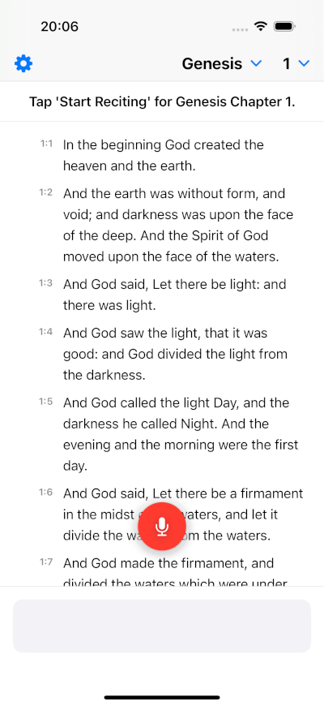
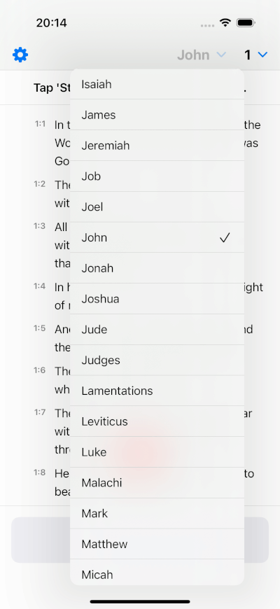
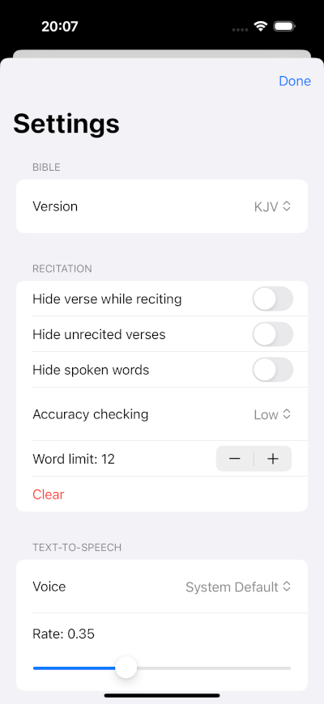

# Speak the Bible - Swift Recitation App

Hi!

I started an iOS app called “Speak the Bible” to help people learn and memorize the Bible in a novel, interactive way. 

In Genesis 1, we read that God spoke the universe into existence—a powerful reminder of the strength found in spoken words. Inspired by this, Speak the Bible helps users internalize Scripture through listening and recitation.

How it works:
By actively engaging your ears, mind, and voice, you deepen your connection to Scripture and improve your ability to internalize it. With consistent daily practice, you'll not only grow spiritually, but also build confidence and sharpen your communication skills.
 

## Contributors

We welcome and recognize all contributions. You can see a list of contributors in the "Contributors" section of the repository. If you would like to contribute, please feel free to submit a pull request.

---

## Screenshots

---

## Features

- **Interactive Recitation:** A "listen and repeat" flow for memorizing verses.
- **Multiple Bible Versions:** Easily switch between different Bible translations like the King James Version (KJV) and World English Bible (WEB). The architecture supports adding more versions.
- **Complete Navigation:** Select any book and swipe between chapters for a seamless reading and recitation experience.
- **Advanced Accuracy Checking:** Utilizes a Soundex-based phonetic algorithm to check recitation accuracy, focusing on how words sound rather than exact spelling.
- **Configurable Settings:**
    - **Accuracy Level:** Choose from multiple accuracy levels (Low, Medium, High, Exact) to match your learning style.
    - **Chunking Control:** Adjust the maximum number of words per recitation segment.
    - **TTS Voice & Rate:** Select from available system voices and adjust the speaking speed.
    - **UI Customization:** Options to hide the verse text while reciting or blur un-memorized verses to challenge your memory.
- **Progress Persistence:** The app saves your progress, keeping track of every verse you've successfully recited across all books.
- **Modern SwiftUI Interface:** A clean, responsive, and intuitive user interface built entirely with SwiftUI.

## How It Works

The core of the app is a state machine managed by the `RecitationManager` that guides the user through the recitation process for each verse.

1.  **Selection:** The user selects a book and chapter to study using the navigation controls.
2.  **Initiation:** Tapping the "Start Reciting" button begins the session. The `RecitationManager` becomes active.
3.  **Tokenization:** The current verse is broken down into smaller, manageable chunks by the `RecitationTokenizer`. This process is guided by a user-defined word limit and natural sentence/clause breaks (like periods or commas).
4.  **Text-to-Speech (TTS):** The `SpeechServiceManager` uses `AVFoundation` to speak the first chunk of text aloud.
5.  **Speech-to-Text (STT):** Once the app finishes speaking, the `SpeechServiceManager` immediately begins recording the user's voice using the `Speech` framework. It provides real-time transcription.
6.  **Verification:** The transcribed text from the user is passed to the `RecitationChecker`. This component normalizes both the original and recited text (e.g., converting "1st" to "first") and compares them phonetically using a Soundex algorithm.
7.  **Feedback & Progression:**
    - If the recitation is deemed **correct**, the app provides positive feedback and automatically moves to the next chunk or the next verse. Successfully recited verses are marked as "revealed."
    - If the recitation is **incorrect**, the app provides gentle feedback and repeats the same text chunk, allowing the user to try again.
8.  **Completion:** The process continues until the entire chapter or book is completed. All progress is saved to `UserDefaults` via the `PersistenceManager`.

## Core Components

The project is architected with a clear separation of concerns, making it scalable and maintainable.

-   **`BibleViewModel`:** Handles the loading, parsing, and management of Bible data from the included JSON files. It supplies the views with the necessary books, chapters, and verses.
-   **`RecitationManager`:** The central state machine for the recitation logic. It orchestrates the flow between speaking, listening, and checking, and it manages the user's progress through the verses.
-   **`SpeechServiceManager`:** A robust wrapper around iOS's `AVFoundation` (TTS) and `Speech` (STT) frameworks. It also manages the app's audio session to prevent conflicts between speaking and listening.
-   **`RecitationChecker`:** Contains the sophisticated logic for comparing text. It includes text normalization (handling numbers, ordinals) and the phonetic Soundex matching algorithm.
-   **`RecitationTokenizer`:** A utility responsible for intelligently splitting verse text into speakable chunks based on word count and punctuation.
-   **`AppSettings`:** A singleton class that uses `@AppStorage` to persist all user-configurable settings.
-   **Views (SwiftUI):**
    -   `ContentView`: The main container view that assembles the UI.
    -   `VerseScrollView`: The main scrolling area that displays verses chapter by chapter using a `TabView`.
    -   `VerseRowView`: The view for a single verse, which can be blurred or highlighted based on the recitation state.
    -   `SettingsView`: The screen where users can customize the app's behavior.
    -   `FloatingRecitationButton`: The main start/stop button for the recitation flow.

## Setup

1.  Clone the repository.
2.  Open the project in Xcode 16.2+.
3.  Build and run on a physical iOS device or simulator.

**Note:** The app will request permission to use Speech Recognition and the Microphone on the first launch. These are required for the core functionality.

## License

This project is licensed under the MIT License. See the `LICENSE` file for details.